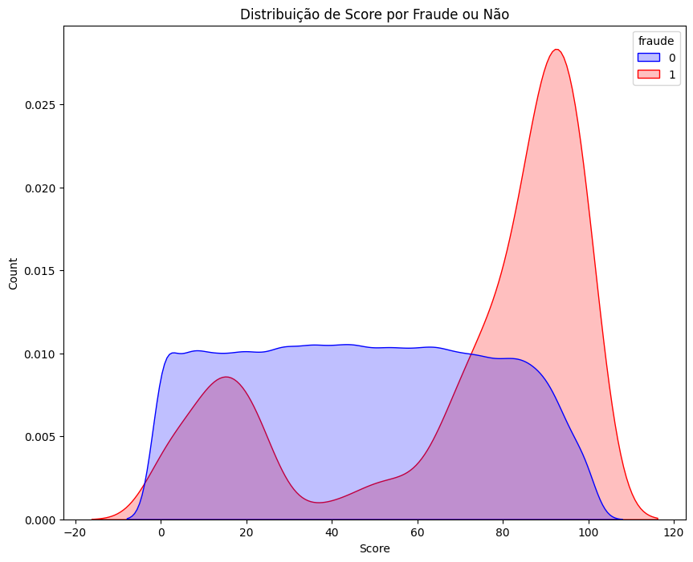
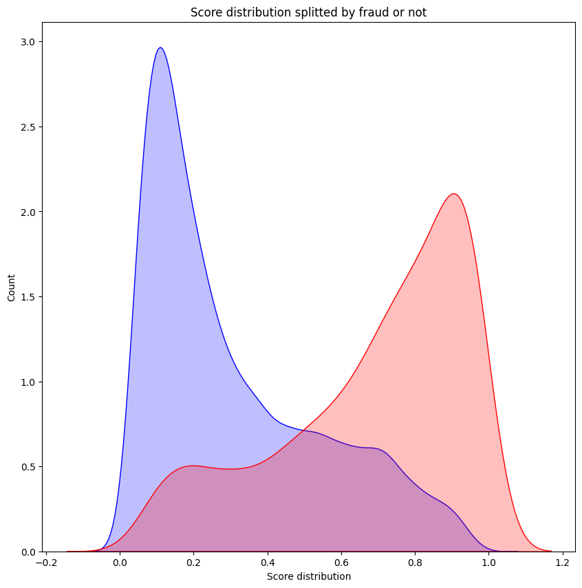

# Fraud Detection

 ## 📌 Overview

  This project aims to conduct an exploratory data analysis and develop machine learning models focused on detecting fraudulent transactions. In this case study, the company already has a fraud detection model; however, due to its limited performance, the proposed initiative is to construct a model capable of surpassing it. Consequently, the ultimate goal is to optimize the identification of fraudulent transactions, leading to a significant increase in the company's profits.

 ## 📊 Analysis of the Old Model

 The company earns 10% of the value for a correctly approved payment but incurs a complete loss, i.e., 100%, in the case of a fraudulent transaction. Therefore, optimizing both the Fraud Rate and Approval Rate is crucial. In the current model of the company designed to predict fraud, as seen in the figure below, a significant issue is observed: the classes are notably overlapped. This indicates that our model struggles to distinguish between legitimate and fraudulent transactions. Ideally, we would like to see a clearer separation between the two classes, indicating that the model can identify distinct characteristics associated with each type of transaction. The overlap suggests that many legitimate and fraudulent transactions share similar characteristics, making the classification task more challenging.

  

  Next, we have the performance of the current model and the value it adds to the company:

 - **Financials**:

  1. **Fraud Losses**: $25,353.320
  2. **Revenue**: $80,329.995
  3. **Profit**: $54,976.675
  4. **Profit Margin**: 68.44%.

 - **Model Performance**:

  1. **Fraud Rate**: 2%
  2. **Approval Rate**: 74%
  3. **Log Loss**: 8.2526
  4. **ROC-AUC**: 0.7193

 The lack of a clear distinction between the classes, as evidenced in the image, along with the presented performance metrics, indicates the need for a review and potential reconfiguration of the model. This may involve considering additional features, applying class balancing techniques, or experimenting with different classification algorithms.

 ## 🛠 Data Preprocessing

 In the data preprocessing stage, Pipelines were employed to ensure efficiency and reproducibility. This pipeline guarantees that the transformations applied to the training data are replicated identically in the test data, eliminating potential errors and inconsistencies.

 However, some important considerations were taken into account:

 1. The column "valor_compra" represents the purchase value and is in a single unit (e.g., Dollar).
 2. There are no additional fraud costs beyond what is mentioned.
 3. None of the columns inserted into the model cause data leakage; all this data is calculated or received before the "Fraud" event occurs.

 Preprocessing Steps in the Pipeline:

 1. Column Exclusion:

 - "score_fraude_modelo": Current model score that should not be considered.
 - "data_compra": To prevent model degradation over time.
 - "produto": Due to high cardinality (more than 8 thousand categories).

 2. Category Treatment:

 - Keep categories in "categoria_produto" that correspond to 80% of frauds.
 - Limit country to "BR", "AR" (which make up more than 90% of the distribution), and "other".
 - Target encoding in "categoria_produto" due to high cardinality.
 - One-hot encoding for other categorical variables.

 3. Handling Null Values:

 - Fill nulls in "score" with the median, as they do not follow a normal distribution.
 - Create a feature "is_null" indicating which "entrega_doc_2" values are null.
 - Consider nulls in "entrega_doc_2" as 0, indicating "not delivered".

 ## 📈 Analysis of the New Model

 When evaluating the performance of the Current Model against the Trained Model, it is evident that the latter exhibits significant improvements not only in performance metrics but also in financial impact. As shown in the figure below, a clearer distinction between legitimate and fraudulent transactions is visible in the Trained Model. This better-defined separation suggests that the model is more capable of identifying distinctive transaction characteristics, resulting in more accurate classifications.

 

 Next, the performance of the current model is presented along with its generated value for the company

 **Financial Performance and Metrics**:

 1. **Optimal Threshold**: 67
 2. **Fraud Losses**: $29,896.12
 3. **Revenue**: $97,932.204
 4. **Profit**: $68,036.084
 5. **ROC-AUC**: 0.8500
 6. **Fraud Rate**: 0.02
 7. **Approval Rate**: 0.86
 8. **Profit/Revenue Ratio**: 72%

 **Comparison between Current Model and Trained Model**:

 1. **Fraud Rate**: Remains constant at 0.02 for both models.
 2. **Approval Rate**: The Trained Model has a higher approval rate, 0.85 compared to 0.74 for the Current Model.
 3. **Profit/Revenue Ratio**: The Trained Model shows a 4% improvement, increasing from 68% in the Current Model to 72%.

 ## 🚀 Conclusions and Next Steps

 Advancements in performance metrics, coupled with promising financial analysis, indicate that the Trained Model is a remarkable evolution from the previous one. It not only positions itself as a more effective tool for fraud identification but also as a potential catalyst for increasing profitability. The next milestone in this journey is to deploy the Trained Model into the real-world scenario, allowing the model to be utilized in everyday operations, translating its theoretical promises into tangible and immediate benefits for the company.
